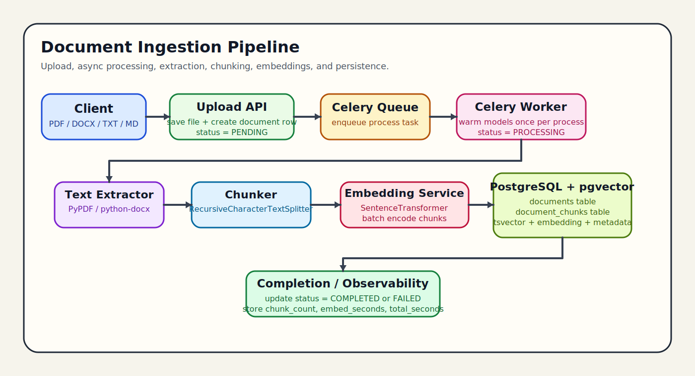
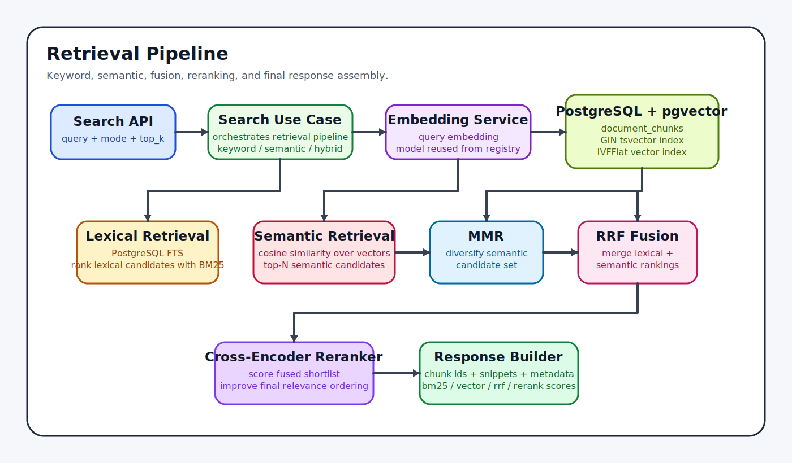

# Hybrid RAG Document Retriever

Backend system using Django, DRF, Celery, PostgreSQL + pgvector, and LangChain-style chunking for asynchronous document ingestion and hybrid search.

## Features

- Upload document (`pdf`, `docx`, `txt`, `md`)
- Async processing with Celery
- Persist chunks with `tsvector` + vector embeddings
- Search modes:
  - keyword (FTS + BM25)
  - semantic (cosine + MMR + rerank)
  - hybrid (RRF fusion + cross-encoder rerank)
- Offline ranking evaluation (`NDCG@5`, `NDCG@10`)

## Clean Architecture

- `core/domain`: entities and value objects
- `core/application`: use-cases + interfaces (ports)
- `core/infrastructure`: Django/DB/Celery/LangChain adapters
- `document`: interface layer (models + DRF views/routes)

Application layer depends only on interfaces, not on Django/Celery/LangChain imports.

## Setup

1. Create env and install dependencies:

```bash
uv sync
```

2. Start infra:

```bash
docker compose up -d
```

3. Configure env:

```bash
cp .env.example .env
```

4. Run migrations:

```bash
cd hybrid_rag
python manage.py migrate
```

5. Run API server:

```bash
python manage.py runserver
```

6. Run Celery worker (new terminal, from `hybrid_rag`):

```bash
celery -A hybrid_rag worker --pool=solo -l info
```

7. Optional: warm model cache before worker start:

```bash
python manage.py warm_models
```

## APIs

- `POST /api/v1/documents/upload` (multipart form-data: `file`)
- `GET /api/v1/documents/{document_id}/status`
- `POST /api/v1/search`

Search payload:

```json
{
  "query": "what is deployment architecture",
  "mode": "hybrid",
  "top_k": 10,
  "filters": {}
}
```

## Architecture Diagrams

### Ingestion Pipeline



The ingestion path starts at the upload API, persists the raw file and a `PENDING` document row, then hands work to Celery. The worker extracts text, splits it into chunks, generates embeddings, stores chunk text plus metadata in PostgreSQL/pgvector, and finally records completion metrics.

### Retrieval Pipeline



The retrieval path combines two ranking strategies in parallel: lexical search through PostgreSQL full-text search plus BM25 scoring, and semantic search through cosine similarity over embeddings. Semantic candidates are diversified with MMR, merged with lexical rankings using RRF, reranked with a cross-encoder, and returned with snippets and score breakdowns.

## Demo Video

Watch or download the demo here: [demo.mp4](docs/demo/demo.mp4)

This video walks through the upload flow, asynchronous ingestion, and hybrid search behavior end to end.

## Design Decisions and Tradeoffs

- Chose PostgreSQL FTS + pgvector to keep single-database architecture.
- BM25 is calculated in-service on lexical candidates to avoid Elasticsearch in v1.
- MMR uses token-overlap approximation for diversity (simpler but less precise than embedding-similarity MMR).
- Cross-encoder reranking improves quality but adds latency.

## Production Improvements

- Add auth + tenant isolation.
- Add malware scanning and OCR for scanned PDFs.
- Add model provider API fallback path and circuit breakers.
- Move background processing observability to OpenTelemetry.
- Add HNSW and adaptive ANN tuning for larger corpora.

## Celery and Model Runtime Notes

- Models are loaded once per worker process using a process-level `ModelRegistry`.
- Worker process warmup is triggered on Celery `worker_process_init`.
- Recommended worker flags for long tasks:

```bash
uv run celery -A hybrid_rag worker --pool=solo -l info --prefetch-multiplier=1
```

- Optional isolation in memory-constrained setups:

```bash
uv run celery -A hybrid_rag worker --pool=solo -l info --prefetch-multiplier=1 --max-tasks-per-child=20
```
